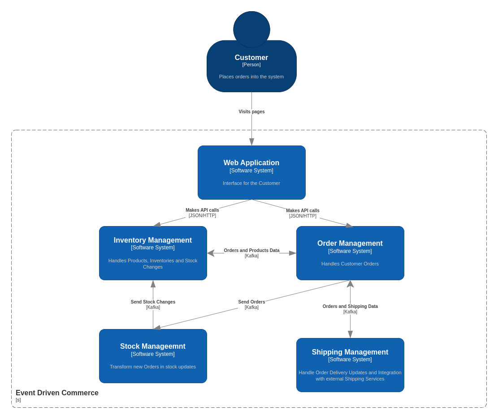

# Event Driven Commerce
An online store built with the Event-Driven Microservice Architecture using Spring Boot and the Kafka Ecosystem

## Technologies
* Spring Boot
* Java 11
* Kafka
* Kafka Streams
* Kafka Connect
* PostgreSQL
* MySQL
* MongoDB
* Redis

## Patterns
* Event Driven Microservices
* Basic Producer/Consumer (BPC)
* Lightweight Stream Processing (Kafka Streams)
* Data Liberation using Kafka Connect
* Database Per Service
* Table-Stream Duality

## How to run locally

### Prerequisites
* JDK 11
* Maven
* Docker
* Docker Compose
* IDE

### Steps
* Run `docker-compose up -d` to bootstrap the necessary services
* Run the script `./shipping-management/scripts/setup_kafka_connect`
* Run the desired microservice(s)
